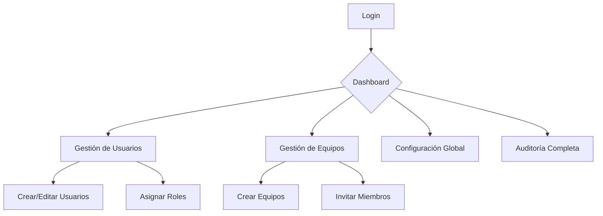
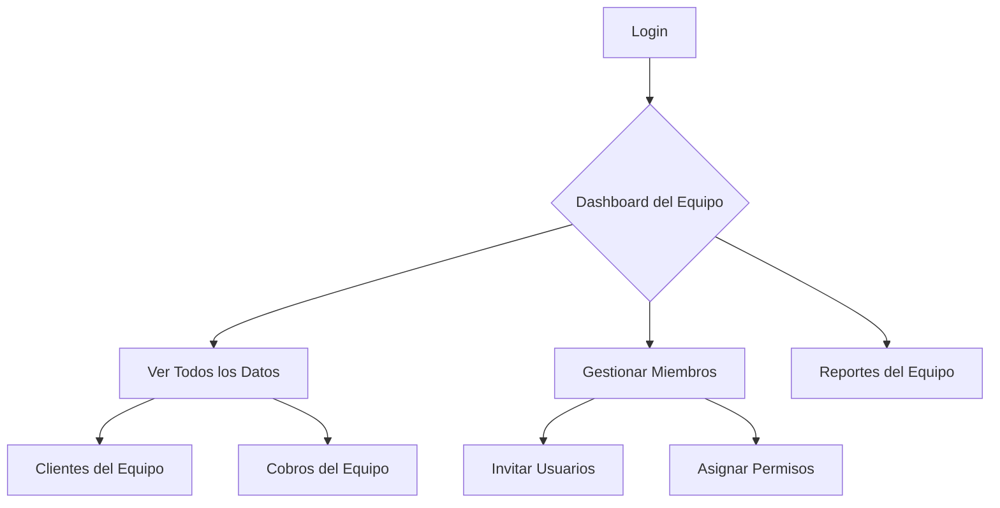
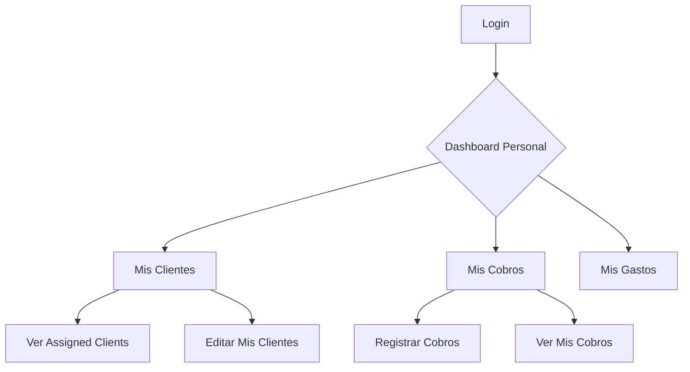

# 👥 Sistema Multi-Usuario Completo

## 🎯 Problema Resuelto

**Antes:** Solo `feronikz@gmail.com` podía ver todo el sistema
**Ahora:** Múltiples usuarios con roles y permisos personalizados

---

## 🏗️ Arquitectura del Sistema

### **Jerarquía de Roles**

```
👑 Super Admin (feronikz@gmail.com)
├── ✅ Control total del sistema
├── ✅ Gestión de todos los usuarios
├── ✅ Creación de equipos
└── ✅ Configuración global

👨‍💼 Admin (por equipo)
├── ✅ Acceso a todos los datos del equipo
├── ✅ Gestión de usuarios del equipo
├── ✅ Auditoría completa
└── ❌ No puede crear otros admins

👤 Usuario (básico)
├── ✅ Acceso a sus datos asignados
├── ✅ Operaciones CRUD limitadas
├── ✅ Vista de dashboard
└── ❌ No puede gestionar usuarios

👁️ Invitado (solo lectura)
├── ✅ Solo puede ver datos específicos
├── ✅ Acceso a reportes
└── ❌ No puede modificar nada
```

---

## 🗄️ **Schema de Base de Datos**

### **1. Tablas Principales**

#### **`profiles`** - Usuarios extendidos
```sql
CREATE TABLE profiles (
  id UUID PRIMARY KEY,           -- auth.users.id
  email TEXT UNIQUE NOT NULL,
  full_name TEXT,
  role TEXT NOT NULL,            -- super_admin, admin, user, guest
  department TEXT,               -- legal, admin, finance, etc.
  is_active BOOLEAN DEFAULT true,
  created_at TIMESTAMP,
  updated_at TIMESTAMP
);
```

#### **`teams`** - Equipos/Despachos
```sql
CREATE TABLE teams (
  id UUID PRIMARY KEY,
  name TEXT NOT NULL,            -- "Despacho Principal"
  description TEXT,
  settings JSONB DEFAULT '{}',
  created_by UUID,               -- Quién creó el equipo
  created_at TIMESTAMP
);
```

#### **`team_members`** - Miembros de equipos
```sql
CREATE TABLE team_members (
  id UUID PRIMARY KEY,
  team_id UUID REFERENCES teams(id),
  user_id UUID REFERENCES profiles(id),
  role TEXT NOT NULL,            -- owner, admin, member
  invited_by UUID,               -- Quién invitó
  joined_at TIMESTAMP
);
```

#### **`permissions`** - Permisos granulares
```sql
CREATE TABLE permissions (
  id UUID PRIMARY KEY,
  user_id UUID REFERENCES profiles(id),
  resource_type TEXT NOT NULL,   -- clientes, cobros, gastos, etc.
  resource_id UUID,              -- NULL = acceso global
  permissions JSONB NOT NULL,    -- {"read": true, "write": false}
  granted_by UUID,
  expires_at TIMESTAMP
);
```

---

## 🔐 **Sistema de Permisos**

### **Permisos por Defecto por Rol**

| Rol | Clientes | Cobros | Gastos | Usuarios | Auditoría |
|-----|----------|--------|--------|----------|-----------|
| **Super Admin** | ✅ CRUD | ✅ CRUD | ✅ CRUD | ✅ CRUD | ✅ CRUD |
| **Admin** | ✅ CRUD | ✅ CRUD | ✅ CRUD | ❌ | ✅ Read |
| **Usuario** | ✅ Read | ✅ Read | ✅ Read | ❌ | ❌ |
| **Invitado** | ✅ Read | ✅ Read | ❌ | ❌ | ❌ |

### **Permisos Granulares**
```typescript
// Ejemplo: Abogado junior con acceso limitado
{
  user_id: "user-123",
  resource_type: "clientes",
  permissions: {
    "read": true,
    "write": false,
    "delete": false
  }
}

// Ejemplo: Contador con acceso a finanzas
{
  user_id: "user-456", 
  resource_type: "cobros",
  permissions: {
    "read": true,
    "write": true,
    "delete": false
  }
}
```

---

## 🚀 **Implementación Paso a Paso**

### **Phase 1: Base de Datos**

#### **1. Ejecutar Schema SQL**
```bash
# En Supabase Dashboard → SQL Editor
# Ejecutar: lib/supabase/multi-user-schema.sql
```

#### **2. Verificar Creación**
```sql
-- Deberías ver estas tablas:
SELECT table_name FROM information_schema.tables 
WHERE table_schema = 'public' 
AND table_name IN (
  'profiles', 'teams', 'team_members', 
  'permissions', 'access_logs'
);
```

### **Phase 2: Actualizar Hooks Existentes**

#### **Modificar `useClientes.ts`**
```typescript
import { useUserContext } from '@/lib/hooks/use-multi-user';

export function useClientes() {
  const userContext = useUserContext();
  const supabase = createClient();

  const fetchClientes = async () => {
    if (!supabase || !userContext) return;

    let query = supabase.from('clientes').select('*');

    // Super Admin ve todo
    if (userContext.isSuperAdmin) {
      // Sin filtros
    }
    // Admin ve todo del equipo
    else if (userContext.isAdmin && userContext.currentTeam) {
      query = query.eq('team_id', userContext.currentTeam.id);
    }
    // Usuario ve solo sus asignados
    else {
      query = query.eq('assigned_to', userContext.profile.id);
    }

    const { data, error } = await query;
    if (error) throw error;
    setClientes(data);
  };
}
```

#### **Aplicar mismo patrón a:**
- ✅ `useCobros.ts`
- ✅ `useGastos.ts`
- ✅ `useProcedimientos.ts`
- ✅ `useFacturas.ts`
- ✅ `useRepartos.ts`

### **Phase 3: Middleware de Permisos**

#### **Crear middleware de roles**
```typescript
// middleware-roles.ts
import { NextResponse } from 'next/server';
import { createServerClient } from '@supabase/ssr';

export async function middleware(request: NextRequest) {
  // Rutas que requieren autenticación
  const protectedRoutes = ['/dashboard', '/clientes', '/cobros', '/gastos'];
  
  // Rutas de admin
  const adminRoutes = ['/historial', '/usuarios', '/equipos'];
  
  // Rutas de super admin
  const superAdminRoutes = ['/system'];

  const pathname = request.nextUrl.pathname;
  
  if (protectedRoutes.some(route => pathname.startsWith(route))) {
    const supabase = createServerClient(/* ... */);
    const { data: { user } } = await supabase.auth.getUser();
    
    if (!user) {
      return NextResponse.redirect(new URL('/login', request.url));
    }

    // Verificar rol para rutas específicas
    if (adminRoutes.some(route => pathname.startsWith(route))) {
      const { data: profile } = await supabase
        .from('profiles')
        .select('role')
        .eq('id', user.id)
        .single();
      
      if (!profile?.role || !['admin', 'super_admin'].includes(profile.role)) {
        return NextResponse.redirect(new URL('/dashboard', request.url));
      }
    }
  }

  return NextResponse.next();
}
```

### **Phase 4: UI de Gestión de Usuarios**

#### **Crear página de administración**
```typescript
// app/admin/usuarios/page.tsx
export default function AdminUsuariosPage() {
  const { userContext } = useUserContext();
  const { getUsers, createUser, updateUser } = useMultiUser();
  
  if (!userContext?.isAdmin) {
    return <div>No autorizado</div>;
  }

  return (
    <LayoutShell title="Gestión de Usuarios">
      {/* Lista de usuarios */}
      {/* Formulario para crear usuarios */}
      {/* Gestión de permisos */}
    </LayoutShell>
  );
}
```

---

## 🎨 **Componentes de UI**

### **1. Selector de Equipo**
```typescript
// components/team-selector.tsx
export function TeamSelector() {
  const { userContext } = useUserContext();
  
  if (!userContext?.currentTeam) return null;
  
  return (
    <div className="bg-blue-50 border border-blue-200 rounded-lg p-3">
      <div className="flex items-center gap-2">
        <Users className="w-4 h-4 text-blue-600" />
        <span className="text-sm font-medium text-blue-900">
          {userContext.currentTeam.name}
        </span>
        <span className="text-xs text-blue-600">
          ({userContext.teamMembers.length} miembros)
        </span>
      </div>
    </div>
  );
}
```

### **2. Badge de Rol**
```typescript
// components/role-badge.tsx
export function RoleBadge({ role }: { role: UserRole }) {
  const colors = {
    super_admin: 'bg-purple-100 text-purple-800',
    admin: 'bg-blue-100 text-blue-800',
    user: 'bg-green-100 text-green-800',
    guest: 'bg-gray-100 text-gray-800'
  };
  
  const labels = {
    super_admin: 'Super Admin',
    admin: 'Admin',
    user: 'Usuario',
    guest: 'Invitado'
  };
  
  return (
    <span className={`inline-flex px-2 py-1 text-xs font-semibold rounded-full ${colors[role]}`}>
      {labels[role]}
    </span>
  );
}
```

### **3. Indicador de Permisos**
```typescript
// components/permission-indicator.tsx
export function PermissionIndicator({ 
  resource, 
  action 
}: { 
  resource: ResourceType; 
  action: PermissionAction; 
}) {
  const { userContext } = useUserContext();
  
  const hasPermission = userContext && 
    (userContext.isSuperAdmin || 
     userContext.permissions.some(p => 
       p.resource_type === resource && 
       p.permissions[action]
     ));
  
  return (
    <div className={`inline-flex items-center gap-1 text-xs ${
      hasPermission ? 'text-green-600' : 'text-red-600'
    }`}>
      {hasPermission ? <Check className="w-3 h-3" /> : <X className="w-3 h-3" />}
      {action}
    </div>
  );
}
```

---

## 📊 **Flujos de Usuario**

### **1. Super Admin**


### **2. Admin de Equipo**


### **3. Usuario Básico**


---

## 🔧 **Configuración Inicial**

### **1. Super Admin Setup**
```sql
-- El usuario feronikz@gmail.com será automáticamente Super Admin
-- al ejecutar el schema SQL

-- Verificar creación
SELECT * FROM profiles WHERE email = 'feronikz@gmail.com';
```

### **2. Crear Primer Equipo**
```typescript
// En el dashboard del Super Admin
const team = await createTeam('Despacho Principal', 'Equipo principal de abogados');
```

### **3. Invitar Primeros Usuarios**
```typescript
// Invitar abogados
await inviteToTeam(team.id, {
  email: 'abogado1@despacho.com',
  role: 'admin',
  permissions: {
    'clientes': ['read', 'write'],
    'cobros': ['read', 'write'],
    'gastos': ['read']
  }
});

// Invitar asistente
await inviteToTeam(team.id, {
  email: 'asistente@despacho.com',
  role: 'member',
  permissions: {
    'clientes': ['read'],
    'cobros': ['read', 'write']
  }
});
```

---

## 🎯 **Beneficios del Sistema**

### **Para el Despacho**
- ✅ **Colaboración real** entre múltiples usuarios
- ✅ **Control granular** de quién ve qué
- ✅ **Auditoría completa** de todas las acciones
- ✅ **Escalabilidad** para crecer el equipo
- ✅ **Seguridad** por niveles de acceso

### **Para los Usuarios**
- ✅ **Acceso personalizado** según su rol
- ✅ **Dashboard relevante** a sus funciones
- ✅ **Claridad** en qué pueden hacer
- ✅ **Trabajo en equipo** coordinado

### **Para el Super Admin**
- ✅ **Visibilidad total** del sistema
- ✅ **Gestión centralizada** de usuarios
- ✅ **Control de costos** por licencias
- ✅ **Cumplimiento** normativo

---

## 📋 **Checklist de Implementación**

### **✅ Base de Datos**
- [ ] Ejecutar `multi-user-schema.sql`
- [ ] Verificar tablas creadas
- [ ] Confirmar Super Admin creado

### **✅ Backend**
- [ ] Actualizar hooks con filtros de equipo
- [ ] Implementar middleware de roles
- [ ] Crear API endpoints para gestión

### **✅ Frontend**
- [ ] Añadir UserProvider al layout
- [ ] Crear páginas de administración
- [ ] Implementar componentes de UI

### **✅ Testing**
- [ ] Probar login con diferentes roles
- [ ] Verificar filtros de datos
- [ ] Testear permisos granulares

---

## 🚀 **Próximos Pasos**

1. **Ejecutar el schema** en Supabase
2. **Actualizar hooks** existentes
3. **Implementar middleware** de roles
4. **Crear UI de administración**
5. **Testear con usuarios reales**
6. **Deploy a producción**

---

## 🎉 **Resultado Final**

Con este sistema tendrás:

- **👥 Múltiples usuarios** trabajando simultáneamente
- **🔐 Control total** de quién accede a qué
- **📊 Dashboard personalizado** por rol
- **🔍 Auditoría completa** de todas las acciones
- **🏢 Escalabilidad** para crecer tu despacho

**¡El sistema estará listo para un uso multi-usuario profesional!** 🎯
